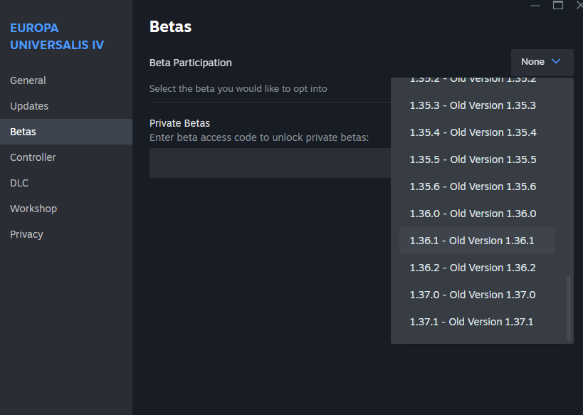

In software, a versioning scheme is a labeling convention for identifying different software releases, and to identify their relationship with each other. For example, if you install Firefox version 128.0, and your friend also has a version 128.0, you know are running the same application ("artifact"), while a version 129.0 would be a newer version. If you encounter a firefox bug, the bug reporting tool will automatically collect the exact version of your application and attach it to the report, so that the developers can install the same version to be able to reproduce the bug. This kind of version is specifically tied to the software package and it enables a variety of tools and processes helping with development and maintenance. The chosen convention is arbitrary, for example a typical windows version identifier looks like this `22631.3880 (23H2)`.

Kelvin versioning is a versioning convention where the software starts at some arbitrarily chosen value of "temperature", `1000K` for example, and each new version of the software decreases the temperature until absolute zero. Once `0K` is reached the tools prevent you from releasing another version.

These tool-oriented versions aren't what most users are exposed to day to day, and for good reasons. `Windows 11` or `MacOS X El Capitan` is a much better version name both for users and for marketting purposes than whatever the specific software "artifact" version numbers are, kelvin or not. In most cases, these "product versions" are independent from the "artifact versions", this means that the software team and the sales teams can do their work independently without getting in the way.

The goal of this 2 part blog post is to explain why kelvin versioning isn't a good idea for software tooling, and how an artifact versioning scheme can't fulfill the grandiose promises made to the urbit users.

Kelvin versioning was invented for the purposes of the Urbit software platform. Despite being touted as a superior versioning scheme by Urbit's advocates, it didn't get any developer adoption outside of the Urbit ecosystem due to its inferiority to the currently used schemes.

Talk about how urbit is unappealing to developers. How because of that the versioning pitch switched from developers to users. How lack of exposure of users is used to sell unrealistic promises where users fill in the gaps that are impossible to implement. How quirks of software versioning are falsely pushed as something that can influence product versioning.

Even though software versioning and its aspects are strictly about programmer development experience, this blogpost will try to aim for an explanation that can also be understood by a general audience, as Urbit advocates include the versioning scheme as a differentiator in their pitch for the new non-programmer users. Due to the nature of the topic, some programmer jargon is required to understand the problems being addressed by versioning schemes, as well as the current solutions and their characteristics.

Isn't it annoying that windows 10 keeps asking you to upgrade to windows 11? Why does Youtube keep redesigning their UI and annoying users, wouldn't it be great if they just stopped changing the layout? They're making it worse every time. Why does my phone need to be periodically updated?

Kelvin versioning solves none of these user problems - as they aren't caused by the numbering scheme used to distinguish the versions. There's nothing in Windows 10 that required a major update, internally it's still using the same build based version counter that it always has, with named major updates in which major OS features and deprecations are introduced.  

Youtube doesn't version their UI in any way, it does version the API and website internally for the software development purposes, but there's no need for versioning the website really - you just get what youtube decides to serve you personally and that is it.

What causes all of this "software churn" then? Some of it is caused by neccessary changes, like support for new hardware or new software solutions. When your system is updated bugs are fixed, user and developer features are added, including making it easier to develop applications or enabling using of new hardware.

Most of the software churn however is caused by the companies selling you the final product. Windows wanted a big update for marketing purposes. Youtube refreshes its ui to monetize you better and to appear more "modern" to users and potential shareholders. They also want to be able to add new features to keep the users coming in and drop the features which turned out too expensive. Youtube needs to be just good enough to not be abandoned for competing platforms and continued changes are needed to maintain that.

Unsurprisingly Urbit does the same thing, right now they're working on a completely new user interface to attract new users just like youtube does. Kelvin versioning didn't prevent them from doing this, in fact no versioning scheme can do this. So, what do versioning schemes actually do?

Topics to cover:
* software as a service
* forever software
* protocols like http
* sky replacing landscape
* how urbit is deprecating stuff at an alarming rate.